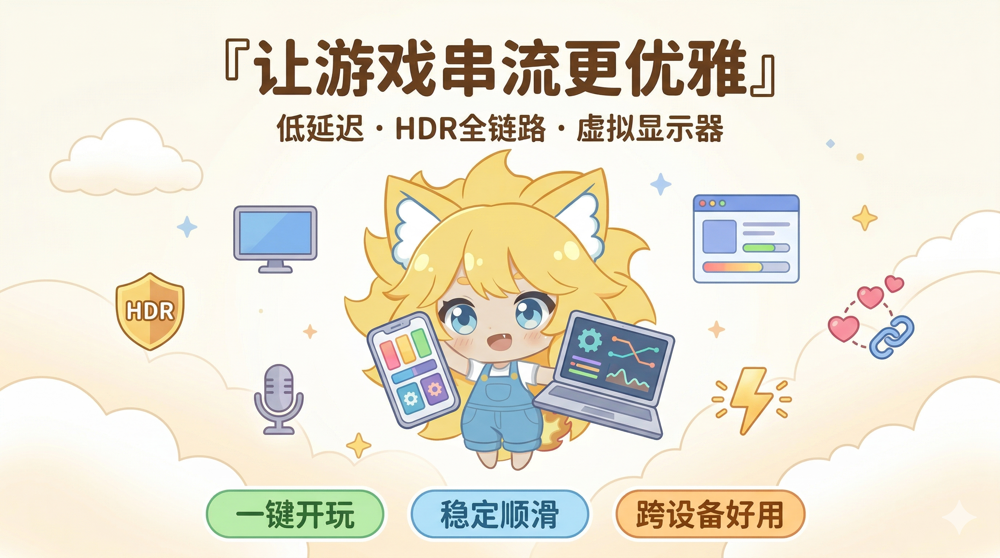

 

基于 [LizardByte/Sunshine](https://github.com/LizardByte/Sunshine) 的增强分支，专注于 Windows 游戏串流体验

[使用文档](https://docs.qq.com/aio/DSGdQc3htbFJjSFdO?p=YTpMj5JNNdB5hEKJhhqlSB) · [LizardByte 文档](https://docs.lizardbyte.dev/projects/sunshine/latest/) · [QQ 交流群](https://qm.qq.com/cgi-bin/qm/qr?k=5qnkzSaLIrIaU4FvumftZH_6Hg7fUuLD&jump_from=webapi)

---

### ░▒▓ 核心特性

- **HDR 全链路** — 双格式编码 (PQ + HLG)・逐帧 GPU 亮度分析・HDR10+ / HDR Vivid 动态元数据・完整静态元数据透传
- **虚拟显示器** — 深度集成 [ZakoVDD](https://github.com/qiin2333/zako-vdd)・5 种屏幕模式・Named Pipe 通信・多客户端 GUID 会话
- **音频增强** — 7.1.4 环绕声 (12ch)・Opus DRED 丢包恢复・持续音频流・远程麦克风・虚拟扬声器位深匹配
- **编码优化** — NVENC SDK 13.0・AMF QVBR/HQVBR・编码器结果缓存 (260x)・自适应下采样・Vulkan 编码器
- **控制面板** — Tauri 2 + Vue 3 + Vite・深色模式・QR 配对・实时监控
- **智能配对** — 客户端独立配置・自动匹配设备能力・虚拟鼠标驱动 (vmouse)

### ░▒▓ 技术细节

<b>HDR 全链路技术方案</b>

#### 双格式 HDR 编码：HDR10 (PQ) + HLG 并行支持

传统串流方案仅支持 HDR10 (PQ) 绝对亮度映射，当终端设备能力不足或亮度参数不匹配时，会出现暗部细节丢失、高光截断等问题。

因此在编码层加入了 HLG（Hybrid Log-Gamma, ITU-R BT.2100）支持，采用相对亮度映射：
- **场景参考式亮度适配**：HLG 基于相对亮度曲线，显示端根据自身峰值亮度自动进行色调映射，低亮度设备上暗部细节保留显著优于 PQ
- **高光区域平滑滚降**：HLG 的对数-伽马混合传输函数在高亮区域提供渐进式滚降，避免 PQ 硬截断导致的高光色阶断裂
- **天然 SDR 向后兼容**：HLG 信号可直接被 SDR 显示器解码为标准 BT.709 画面，无需额外的色调映射处理

**逐帧亮度分析与自适应元数据生成**

在 GPU 端集成了实时亮度分析模块，通过 Compute Shader 对每帧画面执行：
- **MaxFALL / MaxCLL 逐帧计算**：实时统计帧级最大内容亮度（MaxCLL）和帧平均亮度（MaxFALL），动态注入 HEVC/AV1 SEI/OBU 元数据
- **异常值鲁棒过滤**：采用百分位截断策略剔除极端亮度像素（如高光镜面反射），防止孤立高亮点拉高全局亮度参考导致整体画面偏暗
- **帧间指数平滑**：对连续帧的亮度统计值应用 EMA（指数移动平均）滤波，消除场景切换时元数据突变引发的亮度闪烁

**完整 HDR 元数据透传**

HDR10 静态元数据（Mastering Display Info + Content Light Level）完整透传，NVENC / AMF / QSV 编码输出的码流携带符合 CTA-861 规范的完整色彩容积与亮度信息。

**HDR10+ / HDR Vivid 动态元数据注入**

在 NVENC 编码管线中，基于逐帧亮度分析结果，自动生成并注入以下动态元数据 SEI：
- **HDR10+ (ST 2094-40)**：携带场景级 MaxSCL / distribution percentiles / knee point 等色调映射参考，支持 Samsung/Panasonic 等 HDR10+ 认证电视精确色调映射
- **HDR Vivid (CUVA T/UWA 005.3)**：ITU-T T.35 注册的中国超高清视频联盟(CUVA)标准，PQ 模式下提供绝对亮度色调映射、HLG 模式下提供场景参考相对亮度色调映射，覆盖国产终端生态

<b>虚拟显示器集成</b> (需 Windows 10 22H2+)

深度集成 [ZakoVDD](https://github.com/qiin2333/zako-vdd) 虚拟显示器驱动：
- 自定义分辨率和刷新率支持，10-bit HDR 色深
- **5 种屏幕组合模式**：仅虚拟屏、仅物理屏、混合模式、镜像模式、扩展模式
- Named Pipe 实时通信，串流开始/结束时自动创建/销毁虚拟显示器
- 每个客户端独立绑定 VDD 会话（GUID），支持多客户端快速切换
- 无需重启的实时配置更改

<b>音频增强</b>

- **7.1.4 环绕声 (12声道)**：Dolby Atmos 等沉浸式音频布局的完整声道映射
- **Opus DRED 深度冗余**：基于神经网络的丢包恢复，100ms 冗余窗口在网络抖动时平滑补偿
- **持续音频流**：无中断的音频流，无声时自动填充静音数据，避免音频设备反复初始化
- **虚拟扬声器自动匹配**：自动检测并匹配 16bit/24bit 等位深格式的虚拟音频设备

<b>捕获与编码优化</b>

**捕获管线**
- **Gamma-Aware 着色器**：根据 DXGI ColorSpace 自动选择 sRGB / 线性 Gamma 颜色转换
- **高质量下采样**：双三次 (Bicubic) 插值，支持 fast / balanced / high_quality 三档
- **动态分辨率检测**：实时感知显示器分辨率与旋转变化，编码器自适应调整
- **GPU 亮度分析**：Compute Shader 两阶段规约、P95/P99 截断、帧间 EMA 时域平滑

**NVENC**
- **SDK 13.0**：精细化码率控制与 Look-ahead
- **HDR 元数据 API**：NVENC SDK 12.2+ 原生 Mastering Display / Content Light Level 写入
- **HDR10+ / HDR Vivid SEI**：逐帧自动生成 ST 2094-40 和 CUVA T.35 动态元数据
- **SPS 码流规范**：H.264/HEVC SPS bitstream restrictions 完整写入

**AMF (AMD)**
- **QVBR / HQVBR / HQCBR**：高级码率控制，支持质量等级 UI 调节
- **AV1 低延迟**：AV1 编码器无延迟影响的优化选项

**通用**
- **编码器结果缓存**：探测结果持久化，后续连接 26s → <100ms (260x 加速)
- **自适应下采样**：支持双线性 / 双三次 / 高质量三档分辨率缩放，适配 4K 主机→1080p 串流场景
- **Vulkan 编码器**：实验性 Vulkan 视频编码支持
- **无锁证书链**：`shared_mutex` 替代 mutex，消除 TLS 队列开销

 

---

### ░▒▓ 推荐客户端

搭配以下优化版 Moonlight 客户端可获得最佳体验（激活套装属性）

- **PC** — [Moonlight-PC](https://github.com/qiin2333/moonlight-qt)（Windows · macOS · Linux）
- **Android** — [威力加强版](https://github.com/qiin2333/moonlight-vplus) · [王冠版](https://github.com/WACrown/moonlight-android)
- **iOS** — [VoidLink](https://github.com/The-Fried-Fish/VoidLink-previously-moonlight-zwm)
- **鸿蒙** — [Moonlight V+](https://appgallery.huawei.com/app/detail?id=com.alkaidlab.sdream)

更多资源：[awesome-sunshine](https://github.com/LizardByte/awesome-sunshine)

 

<b>░▒▓ 系统要求</b>

| 组件 | 最低要求 | 4K 推荐 |
|------|----------|---------|
| **GPU** | AMD VCE 1.0+ / Intel VAAPI / NVIDIA NVENC | AMD VCE 3.1+ / Intel HD 510+ / GTX 1080+ |
| **CPU** | Ryzen 3 / Core i3 | Ryzen 5 / Core i5 |
| **RAM** | 4 GB | 8 GB |
| **系统** | Windows 10 22H2+ | Windows 10 22H2+ |
| **网络** | 5GHz 802.11ac | CAT5e 以太网 |

GPU 兼容性：[NVENC](https://developer.nvidia.com/video-encode-and-decode-gpu-support-matrix-new) · [AMD VCE](https://github.com/obsproject/obs-amd-encoder/wiki/Hardware-Support) · [Intel VAAPI](https://www.intel.com/content/www/us/en/developer/articles/technical/linuxmedia-vaapi.html)

---

### ░▒▓ 文档与支持

  

想帮杂鱼写代码? →   

 

「 ░▒▓ 」

 

