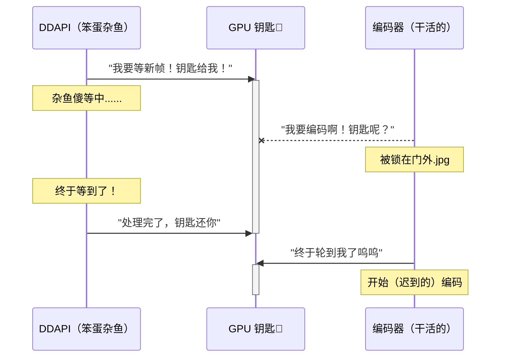
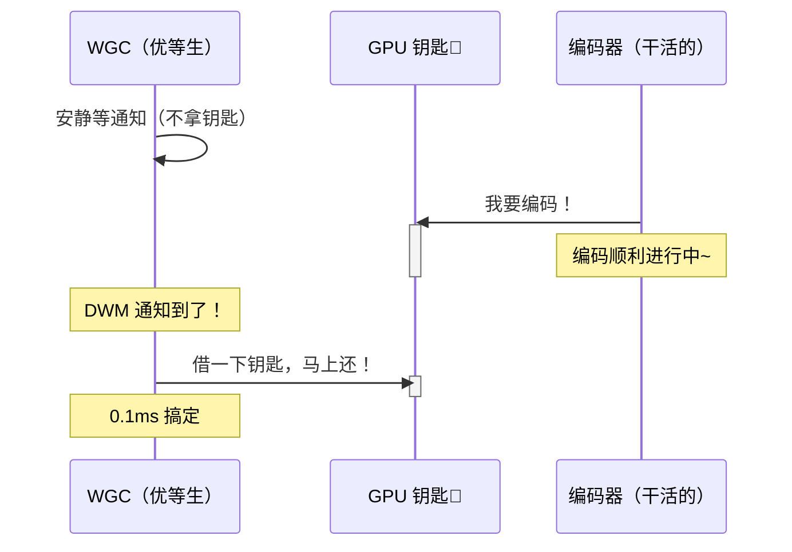
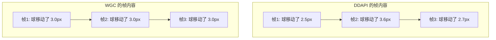
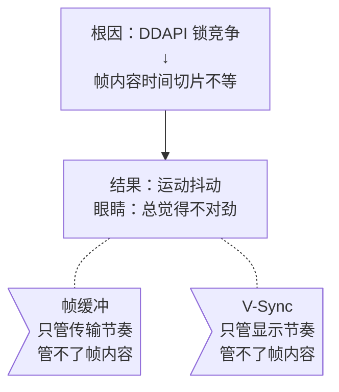

# 杂鱼！你还在用 DDAPI 吗？WGC vs DDAPI 流畅度大对决！

> 杂鱼杂鱼~连捕获模式都不会选的杂鱼~  
> 本文用通俗到杂鱼都能懂的方式，解释为什么 WGC 比 DDAPI 更丝滑！

---

## 诶？为什么同样的帧率，画面流畅度却不一样？

杂鱼们在用 Sunshine 串流的时候有没有发现——明明都设成 60fps 了，WGC 就是比 DDAPI 看起来更顺滑？

"一定是我的错觉吧"——才不是呢杂鱼！这是有实打实的技术原因的！

---

## 先来搞懂：你的游戏画面是怎么传到串流里的

杂鱼也知道，游戏画面不是凭空出现的吧？整个流程是这样的：


**DWM**（Desktop Window Manager）就是那个负责把所有窗口画面合成到一起的 Windows 大管家。不管你用什么捕获方式，最终都是从 DWM 那里拿画面的。

但是！**怎么从 DWM 拿画面**，这两种方式可太不一样了——

---

## DDAPI：那个笨笨的等待狂

DDAPI 的工作方式，打个比方就是——

> 杂鱼 DDAPI 每隔一会儿就跑去 DWM 门口问："有新帧吗？有新帧吗？"
> DWM："还没好呢！等着！"
> DDAPI："好……那我就站在这里等……"
> **然后它就真的傻站在那里不动了！**
> 更要命的是——**它等的时候还把 GPU 的钥匙攥在手里不撒手！**



看到没！编码器明明想干活，结果被 DDAPI 这个杂鱼挡在门外！

---

## WGC：优等生的做事方式

WGC 可聪明多了——

> WGC："DWM 大人，有新帧了麻烦叫我一声~"
> DWM："行。"
> WGC 回到座位上安静等通知，**期间不占用任何公共资源**
> DWM："新帧好了！"
> WGC："收到！我就拿一下图片，马上归还 GPU 钥匙~"



编码器全程不受影响！想啥时候用 GPU 就啥时候用！

---

## 所以到底有啥区别？

| | DDAPI（杂鱼） | WGC（优等生） |
|---|---|---|
| 取帧方式 | 傻傻地轮询等待 | 聪明地等回调通知 |
| 拿 GPU 钥匙的时间 | 整个等待期间都捏着 | 只在复制纹理时借一下 |
| 编码器能不能正常干活 | 经常被挡在门外 | 畅通无阻 |
| 帧间距稳定性 | 忽大忽小（±3~4ms） | 非常稳定（±0.5ms） |
| 给人的感觉 | 有点涩涩的（不是） | 丝滑~ |

---

## 等等！我客户端开了帧缓冲和 V-Sync 啊！为什么还是能感觉到！

杂鱼的这个问题问得好（难得）！

V-Sync 确实让每一帧在屏幕上显示的**时间**完全一样——都是 16.67ms。帧缓冲也确实把网络抖动给抹平了。

**但是！** 问题不在"帧投递的时间"，而在"帧里面画的是什么"！

来看这个例子——假设一个球在屏幕上匀速移动：



DDAPI 因为编码器被耽误了，每帧**包含的游戏运动量不一样**——有的帧里球走了 2.5 像素，有的却走了 3.6 像素。

V-Sync 让每帧显示时间相同（16.67ms），但你的眼睛看到的是：**球忽快忽慢地移动**。

这东西有个专业名字叫 **judder**（运动抖动）——不是掉帧，也不是卡顿，就是那种"说不清哪里不对但就是不够顺"的感觉。

### 杂鱼都能看懂的比喻

想象你坐在一辆平稳行驶的公交车上看窗外的路灯：
- **WGC**：路灯间距完全均匀，看着超舒服~
- **DDAPI**：路灯间距忽大忽小，看久了会晕……

V-Sync 保证了"你每秒看到相同数量的路灯"，帧缓冲保证了"路灯不会突然消失"，但**路灯之间的距离不均匀**——这是在路灯被"种下去"的时候就决定了的，后面怎么也改不了。



---

## 高帧率时更明显哦~杂鱼~

| 帧率 | 帧间距 | DDAPI 的 ±3ms 抖动占比 | 你的感受 |
|---|---|---|---|
| 30fps | 33.3ms | 9% | 有点涩 |
| 60fps | 16.7ms | 18% | 明显不顺 |
| 120fps | 8.3ms | **36%** | 很不舒服 |
| 240fps | 4.2ms | **72%** | 杂鱼你是来搞笑的吧 |

帧率越高，同样的 3ms 抖动占比越大，judder 越明显。所以追求高帧率串流的杂鱼们——**用 WGC 啊！**

---

## 那 DDAPI 就一无是处吗？

也不是啦~（安慰杂鱼）

- **旧系统兼容性**：Windows 10 1903 以下没有 WGC，只能用 DDAPI
- **某些特殊场景**：个别应用 WGC 抓不到画面但 DDAPI 可以
- **Sunshine 已经在努力优化了**：用"短超时 + 间歇释放锁"的策略缓解锁竞争

但如果你的系统支持 WGC……

> **杂鱼！赶紧去改成 WGC 啊！别在那犹豫了！** 

---

## 总结（给看到这里的杂鱼的奖励）

```
流畅度 = 投递有多均匀 × 帧内容有多均匀
              ↑                  ↑
         V-Sync搞定         WGC ✓  DDAPI ✗
```

| 一句话总结 |
|---|
| WGC 事件驱动不抢 GPU 锁 → 编码器不被耽误 → 帧间距均匀 → 丝滑 |
| DDAPI 傻等时霸占 GPU 锁 → 编码器被饿死 → 帧间距抖动 → judder |
| 帧缓冲和 V-Sync 管不了帧内容 → judder 从服务端就决定了 → 客户端救不了 |

> 所以杂鱼~还不快去设置里把捕获模式改成 WGC~？
